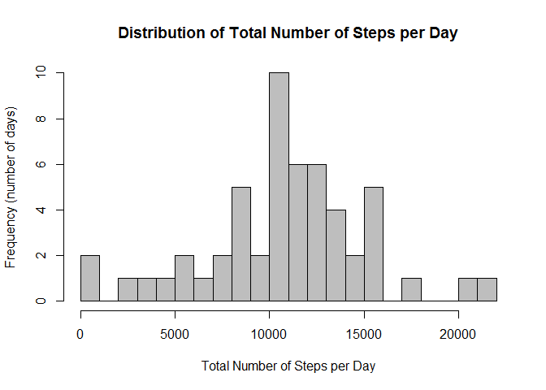
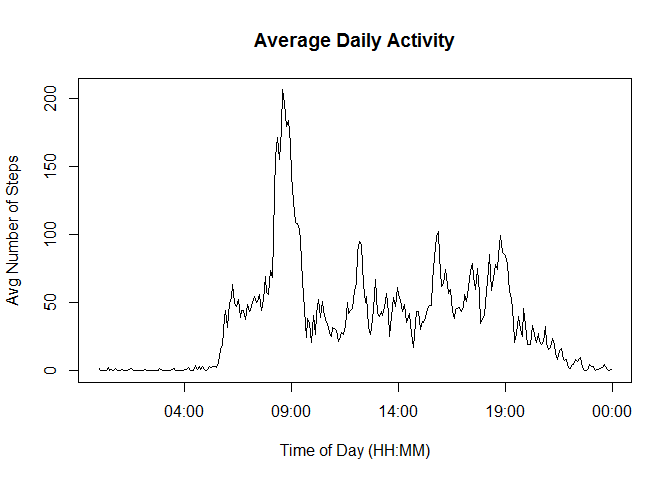
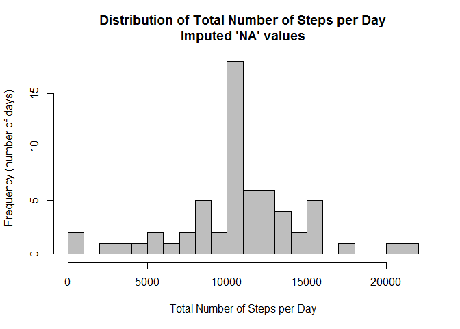
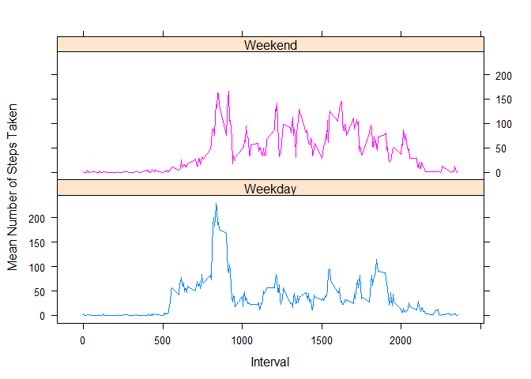

# Reproducible Research: Peer Assessment 1
# Introduction
It is now possible to collect a large amount of data about personal movement using activity monitoring devices such as a Fitbit, Nike Fuelband, or Jawbone Up. These type of devices are part of the “quantified self” movement - a group of enthusiasts who take measurements about themselves regularly to improve their health, to find patterns in their behavior, or because they are tech geeks. But these data remain under-utilized both because the raw data are hard to obtain and there is a lack of statistical methods and software for processing and interpreting the data.

This assignment makes use of data from a personal activity monitoring device. This device collects data at 5 minute intervals through out the day. The data consists of two months of data from an anonymous individual collected during the months of October and November, 2012 and include the number of steps taken in 5 minute intervals each day.

#Analysis

## Loading and preprocessing the data
The data can be downloaded from this link: [Assignment Data](https://d396qusza40orc.cloudfront.net/repdata%2Fdata%2Factivity.zip)

Be sure to save and unzip the *activity.zip* file in your working directory.  

We can see there are 3 variables and 17,658 observations.

```r
activityData <- read.csv("Data/activity.csv", na.strings = "NA")
activityData$date <- as.Date(activityData$date)
str(activityData)
```

```
## 'data.frame':	17568 obs. of  3 variables:
##  $ steps   : int  NA NA NA NA NA NA NA NA NA NA ...
##  $ date    : Date, format: "2012-10-01" "2012-10-01" ...
##  $ interval: int  0 5 10 15 20 25 30 35 40 45 ...
```

The variables in this dataset are:  
*-steps*:  Number of steps taken in a 5-minute interval.  Missing values are coded as **'NA'**.  
*-date*:  The date on which the measurement was taken in YYYY-MM-DD format. Note the conversion to Date format after reading in the data.  
*-interval*: An identifier for the 5-minute interval in which the measurement was taken. For example, 1435 means the measurement was taken at 14:35, or 2:35 pm.  


## What is mean total number of steps taken per day?
We'll answer this question in two steps; first, we'll calculate the total number of steps in a day, and then for each day we'll calcuate the mean for that day.  Values of **'NA'** have not been removed from the data for this analysis.

### 1. Calculate total number of steps per day  
First, we'll be using the 'dplyr' package.


```r
library(dplyr)
```

```
## 
## Attaching package: 'dplyr'
## 
## The following objects are masked from 'package:stats':
## 
##     filter, lag
## 
## The following objects are masked from 'package:base':
## 
##     intersect, setdiff, setequal, union
```

Now we'll calculate the steps per day in a new field, "DailySteps".  This is simply a sum of the steps for each date.


```r
stepsPerDay <- group_by(activityData, date) %>%
        summarize(DailySteps = sum(steps))

head(stepsPerDay)
```

```
## Source: local data frame [6 x 2]
## 
##         date DailySteps
##       (date)      (int)
## 1 2012-10-01         NA
## 2 2012-10-02        126
## 3 2012-10-03      11352
## 4 2012-10-04      12116
## 5 2012-10-05      13294
## 6 2012-10-06      15420
```

### 2. Make a histogram of the total number of steps taken each day  
This histogram shows the frequency with which a number of steps were taken in a day:  


```r
hist(stepsPerDay$DailySteps,
     main = "Distribution of Total Number of Steps per Day",
     xlab = "Total Number of Steps per Day",
     ylab = "Frequency (number of days)",
     breaks = 20,
     col = "grey")
```

 

### 3. Calculate and report the mean and median of the total number of steps taken per day  
There is confusion about calculating the mean and median for each day for for all days. For this analysis, we'll do both.  First, here's the mean and median calucations for each day:  

```r
stepsPerDay <- filter(activityData, steps > 0) %>%
        group_by(date) %>%
        summarize(DailySteps = sum(steps, na.rm = TRUE),
                  DailyMean = mean(steps, na.rm = TRUE),
                  DailyMedian = median(steps, na.rm = TRUE))
stepsPerDay
```

```
## Source: local data frame [53 x 4]
## 
##          date DailySteps DailyMean DailyMedian
##        (date)      (int)     (dbl)       (dbl)
## 1  2012-10-02        126  63.00000        63.0
## 2  2012-10-03      11352 140.14815        61.0
## 3  2012-10-04      12116 121.16000        56.5
## 4  2012-10-05      13294 154.58140        66.0
## 5  2012-10-06      15420 145.47170        67.0
## 6  2012-10-07      11015 101.99074        52.5
## 7  2012-10-09      12811 134.85263        48.0
## 8  2012-10-10       9900  95.19231        56.5
## 9  2012-10-11      10304 137.38667        35.0
## 10 2012-10-12      17382 156.59459        46.0
## ..        ...        ...       ...         ...
```

Now, take a look at the mean and median for all days.  Notice the filter for `steps > 0'.  Without this filter, the median is 0, but with the filter we get a different value, much closer to the mean:  

```r
mean(stepsPerDay$DailySteps, na.rm = TRUE)
```

```
## [1] 10766.19
```

```r
median(stepsPerDay$DailySteps, na.rm = TRUE)
```

```
## [1] 10765
```

## What is the average daily activity pattern?
### 1. Make a time-series plot of the 5-minute interval and average number of steps taken, averaged across all days    
We'll take the mean of all steps, (e.g. 845, 850, etc.) across all days and store it in "AvgIntSteps":  

```r
stepsPerInterval <- group_by(activityData, interval)%>%
        summarize(AvgIntSteps = mean(steps, na.rm = TRUE))

stepsPerInterval
```

```
## Source: local data frame [288 x 2]
## 
##    interval AvgIntSteps
##       (int)       (dbl)
## 1         0   1.7169811
## 2         5   0.3396226
## 3        10   0.1320755
## 4        15   0.1509434
## 5        20   0.0754717
## 6        25   2.0943396
## 7        30   0.5283019
## 8        35   0.8679245
## 9        40   0.0000000
## 10       45   1.4716981
## ..      ...         ...
```

The plot shows each 5-minute interval and the average number of steps taken in that interval, or at that time of day, across all days:  


```r
plot(strptime(sprintf("%04d", stepsPerInterval$interval), format = "%H%M"),
        stepsPerInterval$AvgIntSteps, 
        type = "l",
        main = "Average Daily Activity",
        xlab = "Time of Day (HH:MM)",
        ylab = "Avg Number of Steps")
```

 

### 2. Which 5-minute interval, on average across all the days in the dataset, contains the maximum # number of steps? 

The interval with the highest average number of steps is 0835, or 8:35 am.  The average number of steps in this 5-minute interval is just over 206 steps.  This seems logical since most people are getting ready for and going to work at this time of day. 


```
## Source: local data frame [1 x 2]
## 
##   interval AvgIntSteps
##      (int)       (dbl)
## 1      835    206.1698
```


## Imputing missing values
### 1. Calculate and report the total number of missing values  

```r
colSums(is.na(activityData))
```

```
##    steps     date interval 
##     2304        0        0
```
There are 2304 rows with 'NA' in steps column.  Other columns have no **NA**'s.

#### 2./3. Devise a new strategy for filling in all of the missing values in the dataset.  Create a new dataset, 

We'll replace the **'NA'** values with the mean for that day, using the stepsPerInterval$AvgIntSteps value.  We'll test each value of "steps", and if it is **NA** then we will replace it with the AvgIntSteps calcuated above.  If it is not **NA**, then we will just use the existing value of "steps".


```r
activityImputed <- inner_join(activityData,stepsPerInterval,by="interval") %>%
                mutate(steps=ifelse(is.na(steps), AvgIntSteps, steps)) %>%
                select(date, interval, steps)

head(activityImputed)
```

```
##         date interval     steps
## 1 2012-10-01        0 1.7169811
## 2 2012-10-01        5 0.3396226
## 3 2012-10-01       10 0.1320755
## 4 2012-10-01       15 0.1509434
## 5 2012-10-01       20 0.0754717
## 6 2012-10-01       25 2.0943396
```

### 4. Make a histogram of the total number of steps taken each day. What is the impact of imputing missing data on the estimates of total daily number of steps?  
Imputing the **NA** values didn't change the overall distribution.  In fact, the only thing that changed was the frequency in which the mean value occurred.  This makes sense, since we are now including more values that are, in fact, the mean value we used to replace the **NA**'s.


```r
stepsPerDayImputed <- group_by(activityImputed, date)%>%
        summarize(TotalSteps = sum(steps))
stepsPerDayImputed
```

```
## Source: local data frame [61 x 2]
## 
##          date TotalSteps
##        (date)      (dbl)
## 1  2012-10-01   10766.19
## 2  2012-10-02     126.00
## 3  2012-10-03   11352.00
## 4  2012-10-04   12116.00
## 5  2012-10-05   13294.00
## 6  2012-10-06   15420.00
## 7  2012-10-07   11015.00
## 8  2012-10-08   10766.19
## 9  2012-10-09   12811.00
## 10 2012-10-10    9900.00
## ..        ...        ...
```

```r
hist(stepsPerDayImputed$TotalSteps,
     main = "Distribution of Total Number of Steps per Day\nImputed 'NA' values",
     xlab = "Total Number of Steps per Day",
     ylab = "Frequency (number of days)",
     breaks = 20,
     col = "grey")
```

 

## Are there differences in activity patterns between weekdays and weekends?

### 1. Create a new factor variable in the dataset with two levels -- "Weekday" and "Weekend" -- indicating whether a given date is a week day or a weekend day.  


```r
activityImputed <- mutate(activityImputed, DayClass = as.factor(ifelse(weekdays(date) %in% c("Saturday", "Sunday"), "Weekend", "Weekday")))

str(activityImputed)
```

```
## 'data.frame':	17568 obs. of  4 variables:
##  $ date    : Date, format: "2012-10-01" "2012-10-01" ...
##  $ interval: int  0 5 10 15 20 25 30 35 40 45 ...
##  $ steps   : num  1.717 0.3396 0.1321 0.1509 0.0755 ...
##  $ DayClass: Factor w/ 2 levels "Weekday","Weekend": 1 1 1 1 1 1 1 1 1 1 ...
```

```r
head(activityImputed)
```

```
##         date interval     steps DayClass
## 1 2012-10-01        0 1.7169811  Weekday
## 2 2012-10-01        5 0.3396226  Weekday
## 3 2012-10-01       10 0.1320755  Weekday
## 4 2012-10-01       15 0.1509434  Weekday
## 5 2012-10-01       20 0.0754717  Weekday
## 6 2012-10-01       25 2.0943396  Weekday
```

### 2. Make a panel plot containing a time series plot (i.e. type = "l") of the 5-minute interval (x-axis) and the average number of steps taken, averaged across all weekday days or weekend days (y-axis). 


```r
activityPattern <- group_by(activityImputed, interval, DayClass)%>%
        summarize(MeanSteps = mean(steps))
str(activityPattern)
```

```
## Classes 'grouped_df', 'tbl_df', 'tbl' and 'data.frame':	576 obs. of  3 variables:
##  $ interval : int  0 0 5 5 10 10 15 15 20 20 ...
##  $ DayClass : Factor w/ 2 levels "Weekday","Weekend": 1 2 1 2 1 2 1 2 1 2 ...
##  $ MeanSteps: num  2.2512 0.2146 0.4453 0.0425 0.1732 ...
##  - attr(*, "vars")=List of 1
##   ..$ : symbol interval
##  - attr(*, "drop")= logi TRUE
```

```r
head(activityPattern)
```

```
## Source: local data frame [6 x 3]
## Groups: interval [3]
## 
##   interval DayClass  MeanSteps
##      (int)   (fctr)      (dbl)
## 1        0  Weekday 2.25115304
## 2        0  Weekend 0.21462264
## 3        5  Weekday 0.44528302
## 4        5  Weekend 0.04245283
## 5       10  Weekday 0.17316562
## 6       10  Weekend 0.01650943
```

From the graphs below, it's clear that activity is different on weekends than it is on weekdays.  Weekend activity is generally higher throughout the day, whereas is drops during the working hours of weekday.  It is also noteworthy that weekend morning activity generally starts a bit later in the morning hours.  

**NOTE** Figuring out why x-axis is not sorted properly.  Will update when I have it figured out.

 


